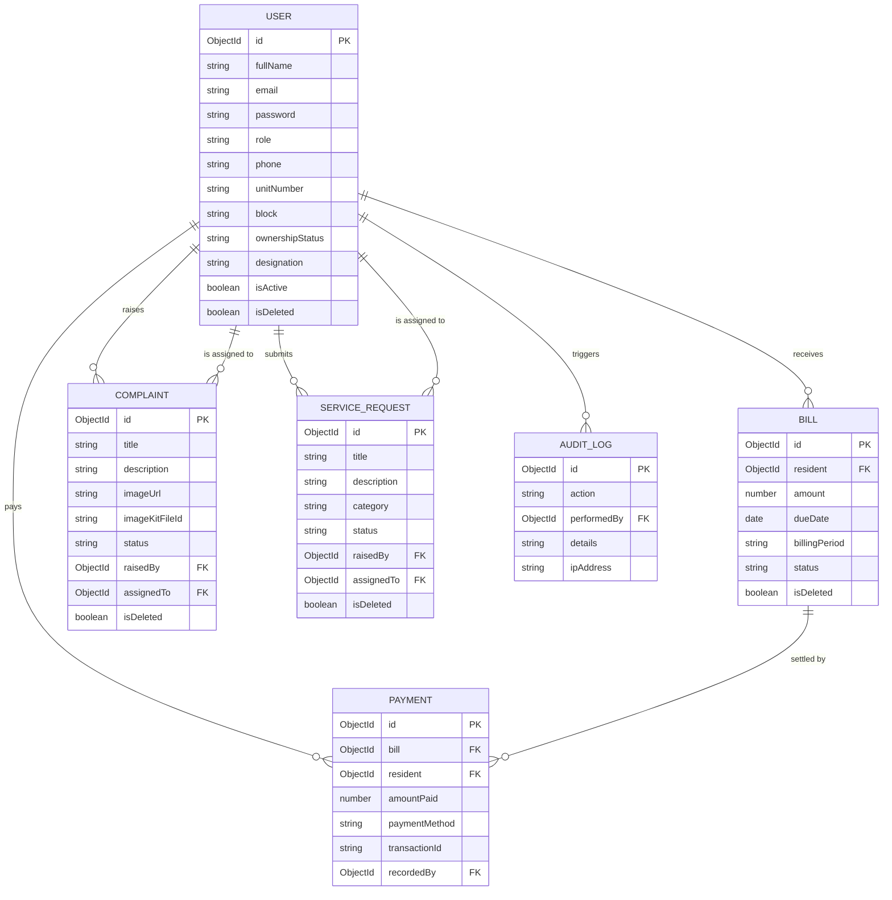

# Society Management System

> [!NOTE]
> The backend server is deployed live on a **Render** instance. Since it is hosted on a free tier, the first API request may experience a warm-up delay of 30-40 seconds, after which it resolves instantly.

A comprehensive, role-based residential society management application designed to streamline property operations, manage billing/invoices, log residents and committee members registries, report complaints/grievances, assign service tasks, and provide immutable system activity audit logs.

## 🧠 Engineering Decisions & AI-Assisted Development

This project was built using modern development workflows, leveraging agentic AI assistance for velocity while maintaining strict manual control over architectural design, security logic, and layout engineering.

*   **Role of AI**: AI was utilized as an advanced pair-programmer to accelerate template boilerplates, generate mock endpoints, write integration tests (`Jest` and `Supertest`), compile the Postman collection payloads, and format markdown documentations.
*   **Engineering Oversight & Manual Refinements**:
    *   **RBAC Security**: Structured route-level role checkers (`ProtectedRoute`) and Mongoose query middleware hooks to automatically filter soft-deleted profiles while retaining financial records for audit logs.
    *   **Layout Re-Architecture**: Replaced sticky positioning with absolute screen height boundaries (`h-screen w-screen overflow-hidden`) on layout containers to resolve horizontal side-scrolling shifts.
    *   **Active Session Checks**: Refactored the core authentication middleware to run real-time account status audits on every request, blocking deactivated sessions instantly.

---

## 🛠️ Technology Stack
*   **Frontend Framework**: React (v19.x) bootstrapped via **Vite** (v6.x)
*   **Styling (CSS)**: Vanilla CSS with custom theme variables, utility classes, and glassmorphic designs
*   **Routing**: React Router DOM (v7.x) with role-based Route Guards
*   **Icons**: Lucide React
*   **Backend Server**: Express (Node.js framework)
*   **Database**: MongoDB Atlas (managed via Mongoose ODM)
*   **Auth System**: JSON Web Tokens (JWT) stored in HTTP-Only secure cookies with Bcrypt password hashing
*   **Storage Service**: ImageKit integration for secure complaint photo attachments (or simulated fallback)

---

## 👥 Role-Based Feature Matrices

| Role Profile | Available Features / Views |
| :--- | :--- |
| **Resident Flat Owner** | View dashboard metrics, view outstanding invoices, pay bills online, review historical transaction receipts, log maintenance complaints (with image attachments), raise service tasks (plumbing, electrical), view community notices, edit personal profile credentials. |
| **Committee Member** | View board dashboard, read and manage assigned resident grievances, append diagnostic comments, self-assign open complaints, mark service tasks as resolved, publish notice bulletins to all residents. |
| **System Administrator** | Access executive dashboards (collected funds, outstanding dues, registered headcounts), manage Resident CRUD registry (activate/deactivate/soft-delete), manage Committee CRUD designations, generate manual or bulk bills, log manual check/transfer payments, publish society announcements, browse immutable system audit log trails. |

---

## 📂 Folder Structure

```
Society-Management-System/
├── backend/
│   ├── src/
│   │   ├── controllers/      # Request handlers (auth, bills, complaints, audit logs)
│   │   ├── db/               # Connection setup & database seed scripts
│   │   ├── middlewares/      # auth check, schema validation, active state checks
│   │   ├── models/           # Mongoose schemas (User, Bill, Complaint, AuditLog, Payment)
│   │   ├── routes/           # REST endpoints
│   │   ├── services/         # ImageKit cloud attachments service
│   │   └── utils/            # Non-blocking async audit logs utility
│   ├── tests/                # Integration tests (Supertest & Jest)
│   └── package.json          # Backend dependencies
├── frontend/
│   ├── src/
│   │   ├── api/              # API wrapper client handlers
│   │   ├── components/
│   │   │   ├── layout/       # AppShell, Navigation Drawer
│   │   │   └── ui/           # Button, Card, Pagination, StampBadge, Spinner
│   │   ├── context/          # Authentication state context
│   │   ├── pages/            # Role dashboards, billing desks, registries, 404
│   │   ├── routes.jsx        # Routing configuration
│   │   ├── index.css         # Typography, HSL themes, scrollbar locks
│   │   └── main.jsx          # React app mount entrypoint
│   └── package.json          # Frontend dependencies
└── README.md                 # Project guide (this file)
```

---

## 📊 Database Schema Design

The application utilizes a fully normalized MongoDB schema designed with clean relations and constraints:



---

## ⚙️ Prerequisites & Environment Variables

### Backend Environment Variables (`backend/.env`)
Create a `.env` file inside the `backend/` directory:
```env
PORT=3000
NODE_ENV=development
MONGO_URI=mongodb://localhost:27017/society-db
JWT_SECRET=your_jwt_secret_key_here
JWT_EXPIRES_IN=24h

# ImageKit keys (Optional; falls back to simulation mock if not supplied)
IMAGEKIT_PUBLIC_KEY=your_imagekit_public_key
IMAGEKIT_PRIVATE_KEY=your_imagekit_private_key
IMAGEKIT_URL_ENDPOINT=https://ik.imagekit.io/your_imagekit_id/
```

### Frontend environment configuration
* The frontend reads from the development proxy or environment configs pointing to `http://localhost:3000`.

---

## 🚀 Getting Started

### 1. Database & Admin Seeding
1. Install **Node.js** (v18+) and ensure **MongoDB** is running locally or connect to a MongoDB Atlas cluster.
2. Navigate to the backend folder and install packages:
   ```bash
   cd backend
   npm install
   ```
3. Run the database seed script to establish the first System Administrator profile:
   ```bash
   npm run seed
   ```
   * *Seeded admin credentials will be logged to the console.*

### 2. Start the Backend Server
```bash
npm run dev
```
* The backend API server starts at `http://localhost:3000`.

### 3. Start the Frontend Client
1. Open a new terminal pane, navigate into the frontend folder, and install packages:
   ```bash
   cd frontend
   npm install
   ```
2. Launch the Vite development server:
   ```bash
   npm run dev
   ```
* The React application will open locally at `http://localhost:5173`.

---

## 🔑 Demo Access Credentials
Use the following seed credentials for demo reviews:

*   **System Administrator**:
    *   **Email**: `ansh@example.com`
    *   **Password**: `admin123`
*   **Resident flat account** (Manual Registration or Admin Created):
    *   Create a resident via `ansh@example.com` at the `/admin/residents` page, copy the generated credentials receipt, and log in.
    *   **Example Email**: `jane.resident@example.com`
    *   **Password**: `residentpassword123`
*   **Committee representative** (Admin Created):
    *   Create a committee member via `/admin/committee`, copy the generated receipt, and log in.
    *   **Example Email**: `rahul@society.com`
    *   **Password**: `committee123`

---

## ⚠️ Known Limitations
*   **Simulated Payment Gateway**: Paying a bill online does not trigger live credit card transactions; it prompts for simulated transaction references and updates database ledger records instantly upon submission.
*   **Manual verification**: Automated browser testing (via Playwright or Selenium) was unavailable during development. Verification and responsive layouts checks were performed manually throughout across desktop, tablet, and mobile viewports.

---

## 📘 Full API Documentation Guide

All routes require requests to send and receive JSON data. Authentication tokens are managed automatically via secure HttpOnly cookies (`token`).

---

### 1. User Authentication

#### A. Register a New User
*   **URL**: `http://localhost:3000/api/auth/register`
*   **Method**: `POST`
*   **Headers**: `Content-Type: application/json`
*   **Dummy Request Body**:
    ```json
    {
      "fullName": "Jane Resident",
      "email": "jane@society.com",
      "password": "residentpassword123",
      "role": "resident",
      "phone": "9876543211",
      "unitNumber": "102",
      "block": "C",
      "ownershipStatus": "owner"
    }
    ```
*   **Dummy Response**:
    ```json
    {
      "message": "User registered successfully",
      "user": {
        "id": "6a55f362b3fb0745bf8e5daf",
        "fullName": "Jane Resident",
        "email": "jane@society.com",
        "role": "resident",
        "phone": "9876543211",
        "unitNumber": "102",
        "block": "C",
        "ownershipStatus": "owner",
        "designation": ""
      }
    }
    ```

#### B. Login User
*   **URL**: `http://localhost:3000/api/auth/login`
*   **Method**: `POST`
*   **Headers**: `Content-Type: application/json`
*   **Dummy Request Body**:
    ```json
    {
      "email": "jane@society.com",
      "password": "residentpassword123"
    }
    ```
*   **Dummy Response**:
    ```json
    {
      "message": "Login successful",
      "user": {
        "id": "6a55f362b3fb0745bf8e5daf",
        "fullName": "Jane Resident",
        "email": "jane@society.com",
        "role": "resident",
        "phone": "9876543211",
        "unitNumber": "102",
        "block": "C",
        "ownershipStatus": "owner"
      }
    }
    ```

#### C. Get Profile Info (/me)
*   **URL**: `http://localhost:3000/api/auth/me`
*   **Method**: `GET`
*   **Headers**: *None (Uses session cookie)*
*   **Dummy Response**:
    ```json
    {
      "success": true,
      "user": {
        "_id": "6a55f362b3fb0745bf8e5daf",
        "fullName": "Jane Resident",
        "email": "jane@society.com",
        "role": "resident",
        "phone": "9876543211",
        "unitNumber": "102",
        "block": "C",
        "ownershipStatus": "owner",
        "designation": "",
        "isActive": true,
        "isDeleted": false,
        "createdAt": "2026-07-14T08:29:22.000Z",
        "updatedAt": "2026-07-14T08:29:22.000Z"
      }
    }
    ```

#### D. Logout User
*   **URL**: `http://localhost:3000/api/auth/logout`
*   **Method**: `POST`
*   **Headers**: *None (Uses session cookie)*
*   **Dummy Response**:
    ```json
    {
      "message": "Logout successful"
    }
    ```

---

### 2. User Administration (Admin Only)

#### A. Admin Registers a Resident
*   **URL**: `http://localhost:3000/api/users/residents`
*   **Method**: `POST`
*   **Headers**: `Content-Type: application/json`
*   **Dummy Request Body**:
    ```json
    {
      "fullName": "Rahul Sharma",
      "email": "rahul@society.com",
      "password": "rahulpassword123",
      "unitNumber": "304",
      "block": "B",
      "ownershipStatus": "tenant",
      "phone": "9123456789"
    }
    ```
*   **Dummy Response**:
    ```json
    {
      "success": true,
      "message": "Resident created successfully",
      "user": {
        "id": "6a55f362b3fb0745bf8e5db1",
        "fullName": "Rahul Sharma",
        "email": "rahul@society.com",
        "role": "resident",
        "phone": "9123456789",
        "unitNumber": "304",
        "block": "B",
        "ownershipStatus": "tenant"
      }
    }
    ```

#### B. Admin Registers a Committee Member
*   **URL**: `http://localhost:3000/api/users/committee`
*   **Method**: `POST`
*   **Headers**: `Content-Type: application/json`
*   **Dummy Request Body**:
    ```json
    {
      "fullName": "Steve Rogers",
      "email": "steve@society.com",
      "password": "stevepassword123",
      "designation": "Secretary",
      "phone": "9876543219"
    }
    ```
*   **Dummy Response**:
    ```json
    {
      "success": true,
      "message": "Committee member created successfully",
      "user": {
        "id": "6a55f362b3fb0745bf8e5db3",
        "fullName": "Steve Rogers",
        "email": "steve@society.com",
        "role": "committee_member",
        "phone": "9876543219",
        "designation": "Secretary"
      }
    }
    ```

#### C. Get All Residents (Paginated & Filterable)
*   **URL**: `http://localhost:3000/api/users/residents?search=&block=&ownershipStatus=&isActive=true&page=1&limit=10`
*   **Method**: `GET`
*   **Headers**: *None (Uses session cookie)*
*   **Dummy Response**:
    ```json
    {
      "success": true,
      "total": 1,
      "page": 1,
      "pages": 1,
      "users": [
        {
          "_id": "6a55f362b3fb0745bf8e5db1",
          "fullName": "Rahul Sharma",
          "email": "rahul@society.com",
          "role": "resident",
          "phone": "9123456789",
          "unitNumber": "304",
          "block": "B",
          "ownershipStatus": "tenant",
          "designation": "",
          "isActive": true,
          "isDeleted": false
        }
      ]
    }
    ```

#### D. Update User Profile
*   **URL**: `http://localhost:3000/api/users/6a55f362b3fb0745bf8e5db1`
*   **Method**: `PATCH`
*   **Headers**: `Content-Type: application/json`
*   **Dummy Request Body**:
    ```json
    {
      "fullName": "Rahul S. Sharma",
      "phone": "9999988888"
    }
    ```
*   **Dummy Response**:
    ```json
    {
      "success": true,
      "message": "User updated successfully",
      "user": {
        "id": "6a55f362b3fb0745bf8e5db1",
        "fullName": "Rahul S. Sharma",
        "email": "rahul@society.com",
        "role": "resident",
        "phone": "9999988888",
        "unitNumber": "304",
        "block": "B",
        "ownershipStatus": "tenant",
        "designation": "",
        "isActive": true
      }
    }
    ```

#### E. Soft Delete User
*   **URL**: `http://localhost:3000/api/users/6a55f362b3fb0745bf8e5db1`
*   **Method**: `DELETE`
*   **Headers**: *None*
*   **Dummy Response**:
    ```json
    {
      "success": true,
      "message": "User deleted successfully"
    }
    ```

---

### 3. Complaint Logs

#### A. Resident Creates Complaint (with optional image)
*   **URL**: `http://localhost:3000/api/complaints`
*   **Method**: `POST`
*   **Headers**: `Content-Type: application/json` *(If sending text-only)* OR `multipart/form-data` *(If uploading an image file)*
*   **Dummy Request Body** (Text/JSON format):
    ```json
    {
      "title": "Broken pipe in garden area",
      "description": "The sprinkler pipeline near block C has burst and is wasting water."
    }
    ```
*   **Dummy Response**:
    ```json
    {
      "success": true,
      "message": "Complaint registered successfully",
      "complaint": {
        "_id": "6a55f363b3fb0745bf8e5db6",
        "title": "Broken pipe in garden area",
        "description": "The sprinkler pipeline near block C has burst and is wasting water.",
        "imageUrl": "https://images.unsplash.com/photo-1560518883-ce09059eeffa?q=80&w=600",
        "imageKitFileId": "mock_1720938563_xyz",
        "status": "open",
        "raisedBy": "6a55f362b3fb0745bf8e5daf",
        "assignedTo": null,
        "comments": [],
        "isDeleted": false,
        "createdAt": "2026-07-14T08:29:23.000Z",
        "updatedAt": "2026-07-14T08:29:23.000Z"
      }
    }
    ```

#### B. Admin Assigns Complaint
*   **URL**: `http://localhost:3000/api/complaints/6a55f363b3fb0745bf8e5db6/assign`
*   **Method**: `POST`
*   **Headers**: `Content-Type: application/json`
*   **Dummy Request Body**:
    ```json
    {
      "assignedTo": "6a55f362b3fb0745bf8e5db3"
    }
    ```
*   **Dummy Response**:
    ```json
    {
      "success": true,
      "message": "Complaint assigned successfully",
      "complaint": {
        "_id": "6a55f363b3fb0745bf8e5db6",
        "title": "Broken pipe in garden area",
        "description": "The sprinkler pipeline near block C has burst and is wasting water.",
        "status": "assigned",
        "assignedTo": "6a55f362b3fb0745bf8e5db3"
      }
    }
    ```

#### C. Committee / Admin Resolves Complaint & Leaves Comments
*   **URL**: `http://localhost:3000/api/complaints/6a55f363b3fb0745bf8e5db6`
*   **Method**: `PATCH`
*   **Headers**: `Content-Type: application/json`
*   **Dummy Request Body**:
    ```json
    {
      "status": "resolved",
      "comment": "Plumber visited and replaced the damaged pipe sleeve. Resolved."
    }
    ```
*   **Dummy Response**:
    ```json
    {
      "success": true,
      "message": "Complaint updated successfully",
      "complaint": {
        "_id": "6a55f363b3fb0745bf8e5db6",
        "status": "resolved",
        "comments": [
          {
            "user": "6a55f362b3fb0745bf8e5db3",
            "comment": "Plumber visited and replaced the damaged pipe sleeve. Resolved.",
            "_id": "6a55f363b3fb0745bf8e5db9",
            "createdAt": "2026-07-14T08:29:23.000Z"
          }
        ]
      }
    }
    ```

---

### 4. Service Requests

#### A. Resident Submits a Service Request
*   **URL**: `http://localhost:3000/api/service-requests`
*   **Method**: `POST`
*   **Headers**: `Content-Type: application/json`
*   **Dummy Request Body**:
    ```json
    {
      "title": "Kitchen faucet leaking",
      "description": "The hot water faucet in the kitchen sink is dripping continuously.",
      "category": "plumbing"
    }
    ```
*   **Dummy Response**:
    ```json
    {
      "success": true,
      "message": "Service request submitted successfully",
      "request": {
        "_id": "6a55f363b3fb0745bf8e5dca",
        "title": "Kitchen faucet leaking",
        "description": "The hot water faucet in the kitchen sink is dripping continuously.",
        "category": "plumbing",
        "status": "pending",
        "raisedBy": "6a55f362b3fb0745bf8e5daf",
        "assignedTo": null,
        "isDeleted": false,
        "createdAt": "2026-07-14T08:30:00.000Z"
      }
    }
    ```

#### B. Admin / Committee updates status and assigns technician
*   **URL**: `http://localhost:3000/api/service-requests/6a55f363b3fb0745bf8e5dca`
*   **Method**: `PATCH`
*   **Headers**: `Content-Type: application/json`
*   **Dummy Request Body**:
    ```json
    {
      "status": "in_progress",
      "assignedTo": "6a55f362b3fb0745bf8e5db3"
    }
    ```
*   **Dummy Response**:
    ```json
    {
      "success": true,
      "message": "Service request updated successfully",
      "request": {
        "_id": "6a55f363b3fb0745bf8e5dca",
        "status": "in_progress",
        "assignedTo": "6a55f362b3fb0745bf8e5db3"
      }
    }
    ```

---

### 5. Maintenance Billing & Payments

#### A. Admin Generates Maintenance Bill for a Resident
*   **URL**: `http://localhost:3000/api/bills`
*   **Method**: `POST`
*   **Headers**: `Content-Type: application/json`
*   **Dummy Request Body**:
    ```json
    {
      "resident": "6a55f362b3fb0745bf8e5db1",
      "amount": 2500,
      "dueDate": "2026-08-10T12:00:00.000Z",
      "billingPeriod": "August 2026"
    }
    ```
*   **Dummy Response**:
    ```json
    {
      "success": true,
      "message": "Bill created successfully",
      "bill": {
        "_id": "6a55f363b3fb0745bf8e5dbb",
        "resident": "6a55f362b3fb0745bf8e5db1",
        "amount": 2500,
        "dueDate": "2026-08-10T12:00:00.000Z",
        "billingPeriod": "August 2026",
        "status": "unpaid",
        "isDeleted": false,
        "createdAt": "2026-07-14T08:29:23.000Z"
      }
    }
    ```

#### B. Admin Records a Payment against the Bill
*   **URL**: `http://localhost:3000/api/payments`
*   **Method**: `POST`
*   **Headers**: `Content-Type: application/json`
*   **Dummy Request Body**:
    ```json
    {
      "bill": "6a55f363b3fb0745bf8e5dbb",
      "amountPaid": 2500,
      "paymentMethod": "online",
      "transactionId": "TXN_PAY_AUG_89234"
    }
    ```
*   **Dummy Response**:
    ```json
    {
      "success": true,
      "message": "Payment recorded successfully and bill status updated to paid",
      "payment": {
        "_id": "6a55f364b3fb0745bf8e5dcc",
        "bill": "6a55f363b3fb0745bf8e5dbb",
        "resident": "6a55f362b3fb0745bf8e5db1",
        "amountPaid": 2500,
        "paymentMethod": "online",
        "transactionId": "TXN_PAY_AUG_89234",
        "recordedBy": "6a55f361b3fb0745bf8e5dac",
        "createdAt": "2026-07-14T08:29:24.000Z"
      }
    }
    ```

#### C. Get All Payments Log
*   **URL**: `http://localhost:3000/api/payments?page=1&limit=10`
*   **Method**: `GET`
*   **Headers**: *None*
*   **Dummy Response**:
    ```json
    {
      "success": true,
      "total": 1,
      "page": 1,
      "pages": 1,
      "payments": [
        {
          "_id": "6a55f364b3fb0745bf8e5dcc",
          "amountPaid": 2500,
          "paymentMethod": "online",
          "transactionId": "TXN_PAY_AUG_89234",
          "resident": {
            "_id": "6a55f362b3fb0745bf8e5db1",
            "fullName": "Rahul Sharma",
            "email": "rahul@society.com"
          },
          "bill": {
            "_id": "6a55f363b3fb0745bf8e5dbb",
            "amount": 2500,
            "billingPeriod": "August 2026"
          }
        }
      ]
    }
    ```

---

### 6. Announcements

#### A. Publish Announcement (Admin / Committee)
*   **URL**: `http://localhost:3000/api/announcements`
*   **Method**: `POST`
*   **Headers**: `Content-Type: application/json`
*   **Dummy Request Body**:
    ```json
    {
      "title": "Water Shutdown Notice",
      "content": "Water supply will be suspended this Thursday from 10:00 AM to 2:00 PM due to clean-up of overhead tanks.",
      "targetAudience": "residents"
    }
    ```
*   **Dummy Response**:
    ```json
    {
      "success": true,
      "message": "Announcement published successfully",
      "announcement": {
        "_id": "6a55f364b3fb0745bf8e5dd2",
        "title": "Water Shutdown Notice",
        "content": "Water supply will be suspended this Thursday from 10:00 AM to 2:00 PM due to clean-up of overhead tanks.",
        "targetAudience": "residents",
        "publishedBy": "6a55f361b3fb0745bf8e5dac"
      }
    }
    ```

---

### 7. Dashboards & Reports

#### A. Get Admin Dashboard Reports
*   **URL**: `http://localhost:3000/api/dashboards/admin`
*   **Method**: `GET`
*   **Headers**: *None*
*   **Dummy Response**:
    ```json
    {
      "success": true,
      "stats": {
        "users": {
          "residents": 2,
          "committee": 1
        },
        "complaints": {
          "open": 0,
          "assigned": 0,
          "resolved": 1,
          "total": 1
        },
        "serviceRequests": {
          "pending": 1,
          "inProgress": 0,
          "completed": 0,
          "total": 1
        },
        "finance": {
          "totalOutstanding": 0,
          "totalCollected": 2500
        }
      },
      "recentAuditLogs": [
        {
          "_id": "6a55f364b3fb0745bf8e5dd5",
          "action": "PAYMENT_RECORDED",
          "performedBy": {
            "fullName": "System Administrator",
            "email": "admin_91518@society.com",
            "role": "admin"
          },
          "details": "Recorded payment of INR 2500 via online for resident ID 6a55f362b3fb0745bf8e5db1"
        }
      ]
    }
    ```

#### B. Get Audit Logs List (Admin Only)
*   **URL**: `http://localhost:3000/api/audit-logs?page=1&limit=20`
*   **Method**: `GET`
*   **Headers**: *None*
*   **Dummy Response**:
    ```json
    {
      "success": true,
      "total": 12,
      "page": 1,
      "pages": 1,
      "logs": [
        {
          "_id": "6a55f364b3fb0745bf8e5dd5",
          "action": "PAYMENT_RECORDED",
          "performedBy": "6a55f361b3fb0745bf8e5dac",
          "details": "Recorded payment of INR 2500 via online for resident ID 6a55f362b3fb0745bf8e5db1",
          "ipAddress": "::1",
          "createdAt": "2026-07-14T08:29:24.000Z"
        }
      ]
    }
    ```

---

## 🛡️ Security & Integrity Engineering Patches
1.  **Privilege Escalation Protection**: Public registration endpoints strictly downgrade the user's role to `"resident"`. Only designated Admin endpoints are allowed to create administrative users or committee members.
2.  **Payment Reference Integrity**: Manual bank transfers (`"online"`) and cheque payment methods strictly validate the presence of a reference string (`transactionId`) before payment records are logged.
3.  **ACID Transactions**: Using Mongoose session transactions, recording payments and updating bill statuses to `"paid"` are performed atomically. Any single-operation failure triggers a database rollback.
4.  **Auto-Filter Soft-Deletes**: Added query middleware hooks to all Mongoose schemas to automatically filter out soft-deleted (`isDeleted: true`) records on all `find` operations while retaining image URLs for financial audits.
